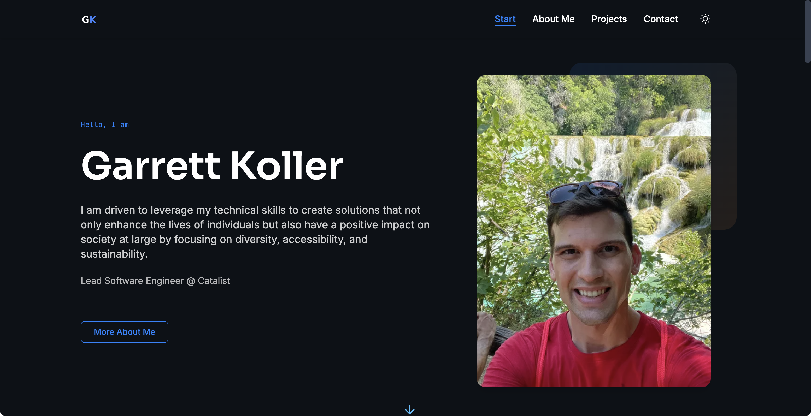

# ✨ Astro Multilingual Portfolio Template

[](https://opensource.org/licenses/MIT)
[](https://astro.build)
[](https://tailwindcss.com)

> 🚀 A modern, lightning-fast portfolio website template built with Astro and Tailwind CSS. Showcase your work in style with multilingual support, dark/light mode, and optimized performance!


*Screenshot of the portfolio template in action*

## ✨ Features

- **🎨 Modern Design** - Clean, professional, and customizable design that makes your portfolio stand out
- **📱 Fully Responsive** - Mobile-first approach ensures your site looks fantastic on all devices, from phones to desktops
- **🌓 Dark/Light Mode** - Automatic theme switching based on system preferences with a sleek manual toggle
- **🌐 Multilingual Support** - Built-in support for English and German with easy expansion to other languages
- **⚡ Lightning Fast** - Leveraging Astro's static site generation for optimal performance (90+ Lighthouse score)
- **✨ Animation Effects** - Subtle animations with GSAP and AOS enhance the user experience
- **🔍 SEO Optimized** - Built-in meta tags, structured data, and optimized assets for better search engine rankings
- **♿ Accessibility** - Designed with accessibility in mind (WCAG 2.1 AA compliant)
- **📝 Easy Content Management** - Update content through simple JSON files without touching the code
- **📊 Performance Optimized** - Compressed images, minimal JavaScript, and optimized assets

## 📋 Included Sections

- **🧭 Navigation** - Sleek header with responsive navigation and language switcher
- **👋 Hero** - Engaging introduction with your photo, name, and call-to-action buttons
- **💡 Values/Approach** - Showcase your professional values and approach to work
- **🛠️ Skills & Tools** - Visually display your expertise across different categories
- **🖼️ Projects** - Beautiful project showcase with details, challenges, and results
- **📚 Experience Timeline** - Chronological display of your professional journey
- **📞 Contact** - Easy-to-find contact information with action buttons
- **📄 Legal Pages** - Ready-to-use imprint and privacy policy pages (GDPR compliant)

## 🧰 Technology Stack

- **[Astro](https://astro.build/)** - Modern static site generator with exceptional performance
- **[Tailwind CSS](https://tailwindcss.com/)** - Utility-first CSS framework for rapid UI development
- **[GSAP](https://greensock.com/gsap/)** - Professional-grade animation library
- **[AOS](https://michalsnik.github.io/aos/)** - Animate on scroll library for elegant scrolling effects

## 🚀 Why Choose This Template?

- **⚡ Performance-First** - Exceptionally fast loading times and smooth interactions
- **🧩 Modular Design** - Easy to add, remove, or rearrange sections to fit your needs
- **🔧 Easy Customization** - Simple structure makes it easy to adapt to your personal brand
- **📱 Mobile Excellence** - Perfectly optimized for all screen sizes
- **🔄 Minimal JavaScript** - Vanilla JS with optional components for better performance
- **🧠 Smart Defaults** - Sensible defaults that look great out of the box
- **🌱 Easy to Extend** - Solid foundation for adding custom functionality

## 🔧 Getting Started

### Prerequisites

- Node.js 16 or higher
- npm or yarn

### 📥 Installation

1. **Clone this repository**
```bash
git clone https://github.com/nicremo/astro-multilingual-portfolio-template.git
cd astro-multilingual-portfolio-template
```

2. **Install dependencies**
```bash
npm install
```

3. **Run the development server**
```bash
npm run dev
```

4. **Open your browser** and navigate to `http://localhost:4321`

## 🎨 Customization

### 📝 Personal Information

Update your contact information in `src/utils/me.ts`:
- Name
- Homepage URL
- LinkedIn username
- GitHub username

The following contact fields are also in `src/utils/me.ts` but are Base64 encoded to obfuscate them in the GitHub repo.
See the comments in `me.ts` for instructions on how to encode your information in Base64 with a simple command.
- Email
- Phone
- Address (for privacy policy)

Also update your information in the following other files:
- `astro.config.mjs` and `robots.txt`: Replace `https://max-example.de/` with your site's URL
- `src/i18n/en.json` and `src/i18n/de.json`: Contains all text content in English and German
- Replace images in `src/assets/` with your own:
  - `logo.png` and `logo_white.png` - Your brand logos
  - `profile.png` - Your profile photo
  - `favicon.png` - The favicon for your website
  - Other images for projects and sections

### 🎭 Theme Colors

Modify the Tailwind configuration in `tailwind.config.mjs` to change the color scheme:

```js
// Example customization
theme: {
  extend: {
    colors: {
      primary: '#3B82F6',       // Change to your primary brand color
      secondary: '#1F2937',     // Change to your secondary color
      accent: '#10B981',        // Change to your accent color
      // ... other color customizations
    }
  }
}
```

### 🖼️ Adding Projects

Add your projects by editing the project section in the language files:

```json
"projects": {
  "title": "Selected Projects",
  "subtitle": "A selection of my best work",
  "projectName": {
    "shortDescription": "Brief description of the project",
    "challenge": "The problem this project solved",
    "approach": "How you approached the solution",
    "result": "The outcome and impact of the project"
  }
}
```

### 🌐 Adding Another Language

1. Create a new language file in `src/i18n/` (e.g., `fr.json` for French)
2. Copy the structure from `en.json` and translate all values
3. Update the language switcher component to include the new language

## 🚀 Deployment

This site can be deployed to any static hosting service like Netlify, Vercel, or GitHub Pages.

```bash
npm run build
```

This will generate static files in the `dist` directory which can be deployed.

### Deployment Platforms

- **[Netlify](https://netlify.com)**: Connect your GitHub repository for continuous deployment
- **[Vercel](https://vercel.com)**: Ideal for personal projects with simple deployment
- **[GitHub Pages](https://pages.github.com)**: Free hosting directly from your repository

## 🔍 Browser Compatibility

This template is compatible with all modern browsers:

- Chrome (and Chromium-based browsers)
- Firefox
- Safari
- Edge
- Opera

## 🙋 FAQ

**Q: Do I need to know Astro to use this template?**
A: No, you can customize most content through the JSON files without touching the Astro code.

**Q: Can I use this for a commercial project?**
A: Yes, this template is available under the MIT license.

**Q: How do I add more sections?**
A: You can create new components in `src/components/sections/` and then add them to the appropriate page layout.

## 📄 License

This project is available as open source under the terms of the [MIT License](LICENSE.md).

## 🙌 Contribute

Contributions, issues and feature requests are welcome! Feel free to check the [issues page](https://github.com/nicremo/astro-multilingual-portfolio-template/issues).

## 💖 Credits

This template was created to serve as a starting point for personal portfolio websites. Feel free to use it for your own projects!

---

Created with ❤️ by [Fabian](https://fabian-bitzer.de).

## 🔎 SEO Keywords

Astro Portfolio Template, Multilingual Portfolio Website, Static Site Generator Template, Astro Tailwind Template, Personal Portfolio Builder, Developer Portfolio Template, Responsive Portfolio Website, Dark Mode Portfolio, i18n Portfolio Template, Modern Web Portfolio, Portfolio Website Template, Astro SSG, Portfolio with Language Switcher, Professional Portfolio Template, Web Developer Portfolio, Creative Portfolio Astro, Mobile-First Portfolio, Performance Optimized Portfolio, SEO-Friendly Portfolio Template, Customizable Portfolio Website
